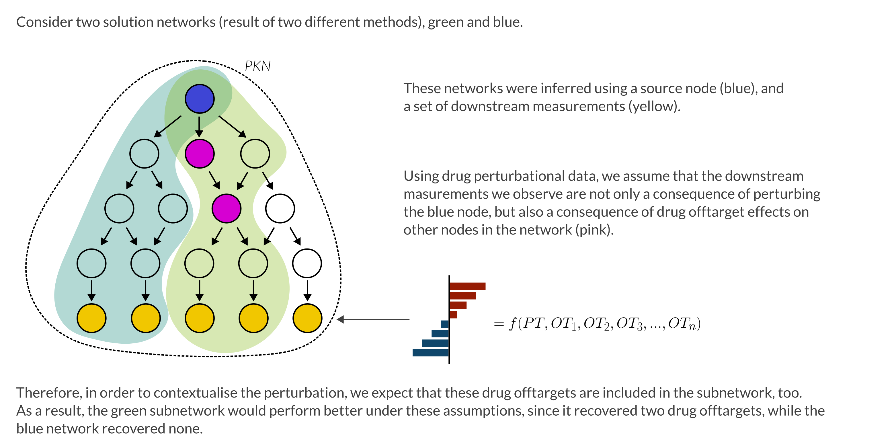

#####################
Evaluation strategies
#####################

One of the main aims of NetworkCommons is to provide a comprehesive set of metrics to evaluate the performance of the different network inference methodologies. 
Currently, we provide three different evaluation strategies. 
If you want to contribute with your own, please check our :doc:`Contribution guidelines <guidelines/guide_3_eval>`.

.. _eval-offtarget:

------------------
Offtarget recovery
------------------

**Data**: perturbational scenarios, e.g a drug perturbation, for which there are differential expression profiles between control and drug-perturbed samples.
See :ref:`PANACEA <details-panacea>`.

**Assumption**: In this setting, we assume that, in a perturbational context, the effects that are measured via omics data is not only a product of the perturbation origin 
(e.g KO, KD, drug perturbation), but also of other origins of perturbation that are not directly targeted by the perturbation agent (e.g a drug offtarget).

**Performance metric:** 
    
.. note::
    Methods that recover a higher share of offtargets, compared to a random control, will be more successful in contextualising the perturbation, since the method incorporates
    the offtargets' effect. 

**Example:** :doc:`Vignette 1: A simple example <vignettes/1_simple_example>`

.. _eval-ec50:

------------------------------------------------
Phosphorylation sensitivity to drug perturbation
------------------------------------------------

**Data**: phosphoproteomics dose-response curves, EC50 values, time-course data, 
See :ref:`DecryptM <details-decryptm>`.

**Assumption**: In this setting, we assume that, in a perturbational context, those elements in a network that respond quicker to a perturbation (have a lower EC50) will be more
important in the contextualisation of said perturbation

**Performance metric:** Average EC50 values for nodes included and excluded of the solution network.
    
.. note::
    Methods producing result networks whose nodes have a low average EC50 (compared to nodes not included in the network) are better performers that those producing network 
    where this difference (EC50_in - EC50_out) is not that big.

**Example:** :doc:`Vignette 3: Sensitive response to drug perturbation using phosphoproteomics <vignettes/3_evaluation_decryptm>`

.. _eval-pathway:

---------------------------
Pathway enrichment analysis
---------------------------

**Data**: perturbational scenarios, dysregulation (e.g cancer basal profiles), basal profiles (e.g tissue specific profiles)
See :ref:`PANACEA <details-decryptm>`.

**Assumption**: In this setting, we use the nodes of the subnetworks to perform Overrepresentation Analysis against a set of predefined gene sets, among which we expect one to be especially represented
(for example, a specific pathway will be overrepresented if said pathway is perturbed, or is especially active/inactive in a given profile)

**Performance metric:** rank of the selected gene set among all gene sets, according to ORA score
    
.. note::
    Having preselected a gene set of interest, the methods producing networks in which the said geneset is ranked high, according to their ORA score, against others, will have a better performance. 

**Example:** :doc:`Vignette 1: A simple example <vignettes/1_simple_example>`

.. _eval-multiomics:

--------------------------------
Recovery of dysregulated kinases
--------------------------------

**Data**: perturbational scenarios, dysregulation (e.g cancer basal profiles)
See :ref:`CPTAC <details-cptac>`.

**Assumption**: In this setting, we use three different types of omics data:

* **Proteomics**: we identified the most differentially abundant receptors in the proteomics profiles between healthy and tumor samples. We assume that if they are differentially abundant, they will be activated/inhibited.
* **Transcriptomics**: we performed TF enrichment analysis, in order to get the TFs that are dysregulated in the tumor samples compared to the healthy control.
* **Phosphoproteomics**: we performed kinase activity estimation and then evaluate the level of dysregulation in the resulting subnetwork.

**Performance metric:** share (%) of nodes that are dysregulated according to their kinase activity score

.. note::
    Methods whose result subnetworks contain a higher share of dysregulated elements compared to the overall phosphoproteome, will show better performance.

**Example:** :doc:`Vignette 4: Recovery of dysregulated kinases in response to cancer mutations <vignettes/4_cptac_phosphoactivity>`

