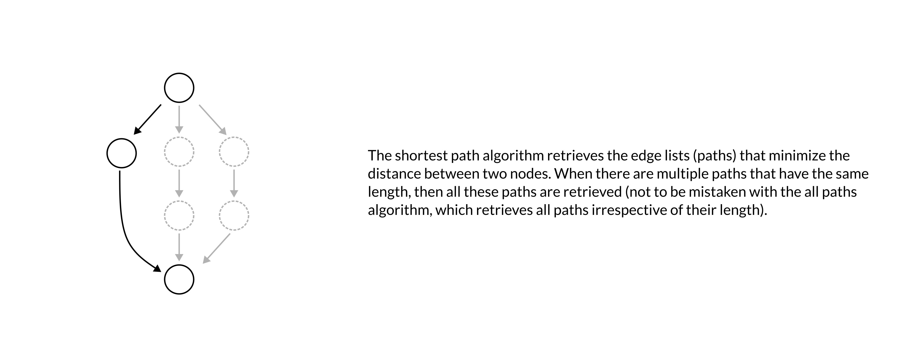
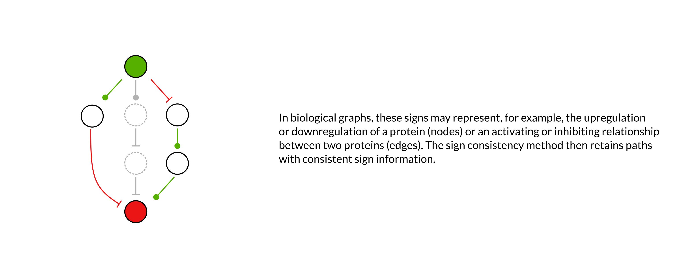
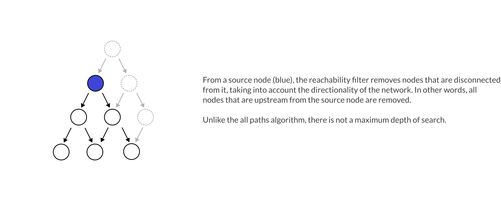
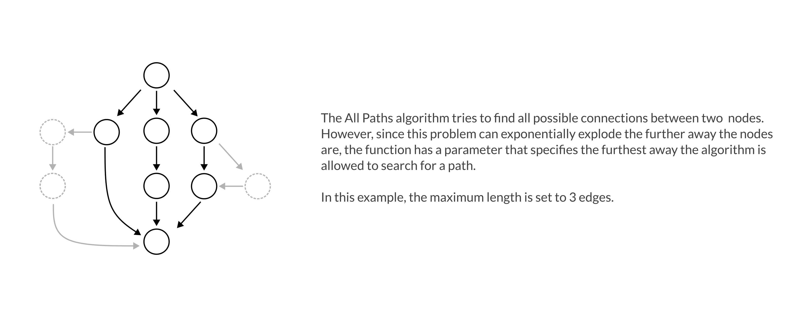
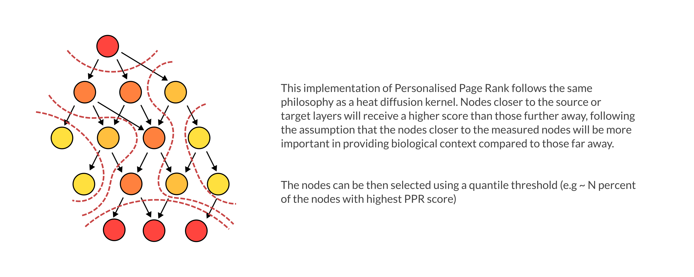

#######
Methods
#######

-------------------
Topological methods
-------------------

Shortest path
-------------

The shortest path is an algorithm for finding one or multiple paths that minimize the distance from a set of starting nodes to a set of destination nodes in a weighted graph (https://doi.org/10.1007/BF01386390).

   
**Input:** Set of source and target nodes, (weighted) network graph

**Node weights:** w(v) = 1

**Edge weights:** 0 ≤ w(e) ≤ 1

Sign consistency
----------------

The sign consistency method checks for sign consistency between the nodes in a given graph. Hereby, source and target nodes, as well as the edges in the graph have an assigned sign. 

**Input:** Set of source and target nodes (with a sign for up- or downregulation), network graph

**Node weights:** w(v) ∈ {1, −1}

**Edge weights:** w(e) ∈ {1, −1}

Reachability filter
-------------------

The reachability filter generates a network consisting of all reachable nodes from a set of starting nodes.

**Input:** Set of source nodes, network graph

**Node weights:** w(v) ∈ {1}

**Edge weights:** w(e) ∈ {1}

All paths
---------

All paths find all possible connections between a set of source nodes and a set of target nodes. In contrast to the shortest path method or the sign consistency method it doesn’t take the distance or any sign information into account, respectively.

**Input:** Set of source and target nodes, network graph

**Node weights:** w(v) ∈ {1}

**Edge weights:** w(e) ∈ {1}

--------------------------------------
Random walk with restart (RWR) methods
--------------------------------------

Page rank
---------

The Page rank algorithm initially calculates a weight for each node in a graph based on a random walk with restart method. It starts at a set of source or target nodes and determines the importance of the other nodes in the graph based on the structure of the incoming or outgoing edges. It then builds a network considering the highest-ranking nodes starting from each of the source and the target nodes.

**Input:** Set of source and target nodes, network graph

**Node weights:** w(v) ∈ {1}

**Edge weights:** w(e) ∈ {1}

----------------------------
Recursive enrichment methods
----------------------------

MOON
----

MOON (meta-footprint method) performs iterative footprint activity scoring and network diffusion from a set of target nodes to generate a sign consistent network (https://doi.org/10.1101/2024.07.15.603538). Starting from a set of weighted target nodes it calculates a weight for the next layer of upstream nodes using a univariate linear model. This process is repeated until a set of source nodes or a certain number of steps is reached. Hereby, any source node with an incoherent sign between MOON and the input sign is pruned out along with all incoming and outgoing edges. Additionally, edges between two inconsistent nodes are removed.

**Input:** Set of weighted target nodes (and optionally weighted source nodes), network graph

**Node weights:** w(v) ∈ ℝ

**Edge weights:** w(e) ∈ ℝ

-----------------
ILP-based methods
-----------------

CORNETO - CARNIVAL
------------------

CORNETO (Constraint-based Optimization for the Reconstruction of NETworks from Omics) is a unified network inference method which combines a wide range of network methods including CARNIVAL which is currently implemented in NetworkCommons. CARNIVAL (CAusal Reasoning for Network identification using Integer VALue programming) connects a set of weighted target and source nodes using integer linear programming (ILP) and predicts the sign for the intermediate nodes (https://doi.org/10.1038/s41540-019-0118-z). Thereby, it optimizes a cost function that penalizes the inclusion of edges as well as the removal of target and source nodes. Additionally, it considers a set of constraints that among other things do not allow sign inconsistency.

**Input:** Set of weighted target and source nodes, network graph

**Node weights:** w(v) ∈ ℝ

**Edge weights:** w(e) ∈ {1, −1}
